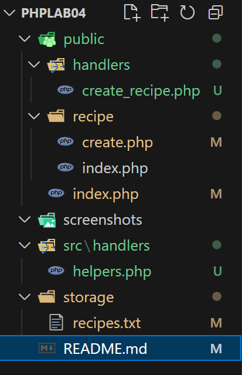
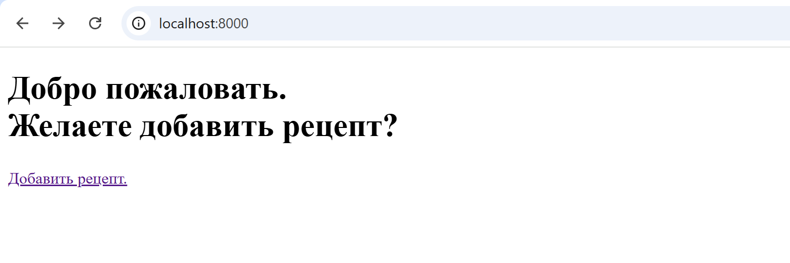
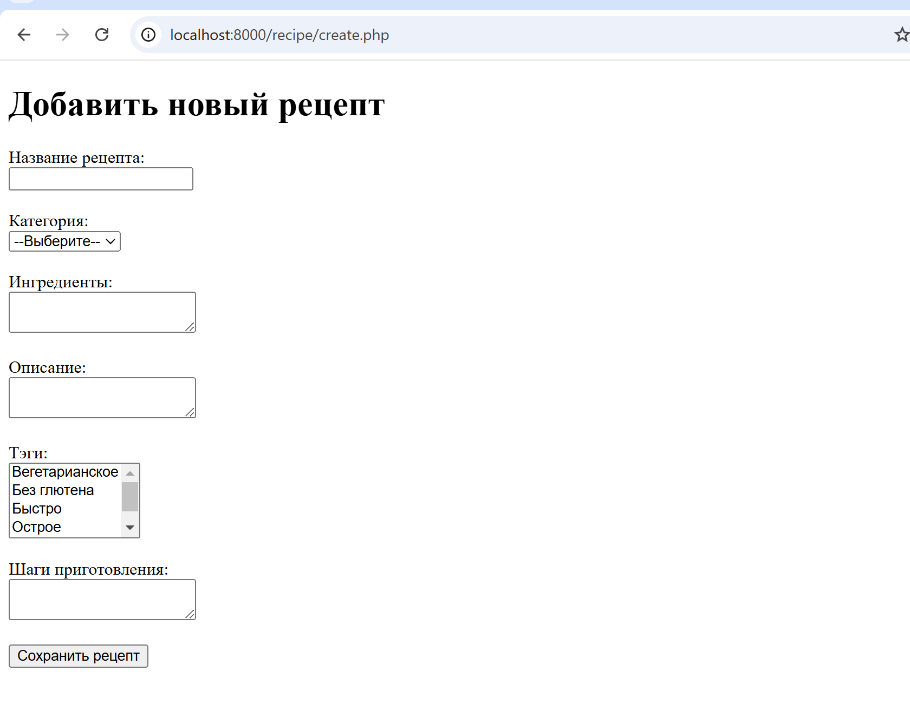
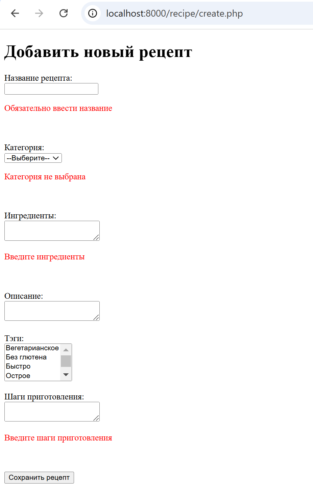
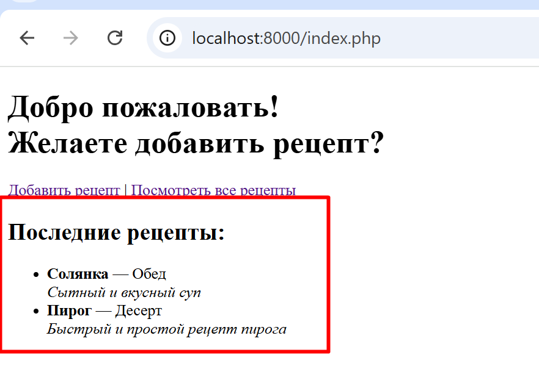
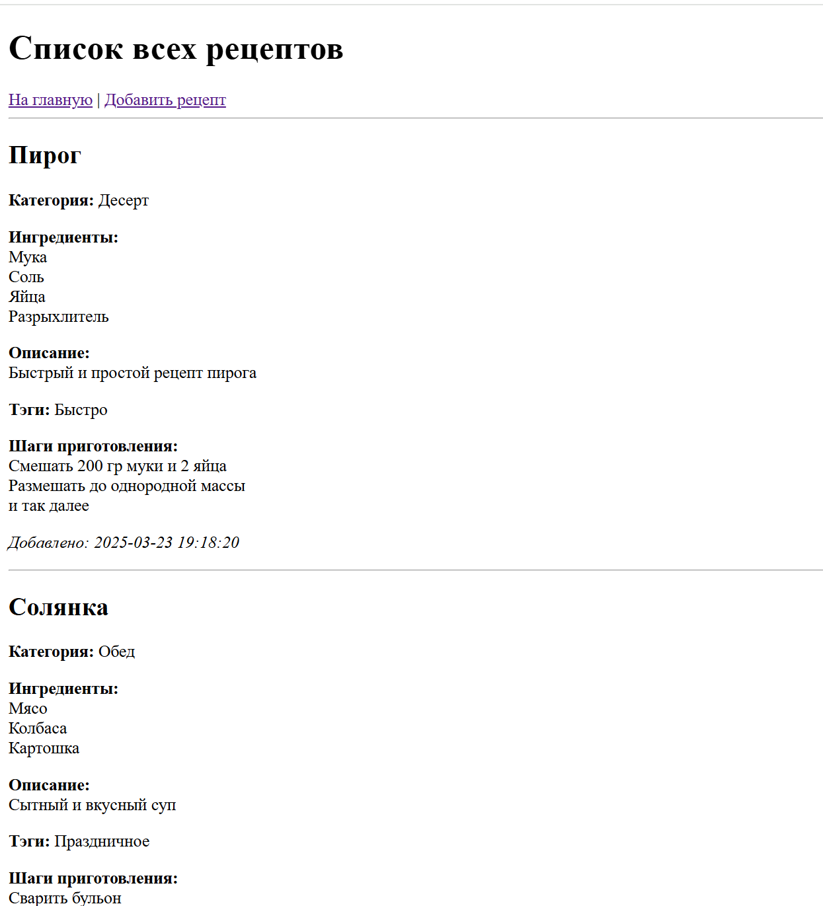

# Лабораторная работа №4. Валидация форм

## Студент
**Gachayev Dmitrii I2302**  
**Выполнено 23.03.2025**  

## Цель работы
Освоить основные принципы работы с HTML-формами в PHP, включая отправку данных на сервер и их обработку, включая валидацию данных.

## Инструкция к запуску проекта
1. Клонировать проект на компьютер.
2. Запустить командную строку в папке `phplab04/public`.
3. Выполнить команду `php -S localhost:8000`.
4. Перейти на `http://localhost:8000/`.


## Задание 1. Создание проекта.

Создаю и организовываю файловую структуру проекта, ориентируясь на пример:

```
phplab04/
├── public/                        
│   ├── index.php                   # Главная страница (вывод последних рецептов)
│   └── recipe/                    
│       ├── create.php              # Форма добавления рецепта
│       └── index.php               # Страница с отображением рецептов
├── src/                            
│   ├── handlers/                   # Обработчики форм
│   └── helpers.php                 # Вспомогательные функции для обработки данных
├── storage/                        
│   └── recipes.txt                 # Файл для хранения рецептов
└── README.md                       # Описание проекта
```

Созданная мной структура:



## Задание 2. Создание формы добавления рецепта

Создаю форму ссылаясь на указанные условия.

1. Форма содержит следующие поля:
- Название рецепта (`<input type="text">`);
- Категория рецепта (`<select>`);
- Ингредиенты (`<textarea>`);
- Описание рецепта (`<textarea>`);
- Тэги (выпадающий список с возможностью выбора нескольких значений, `<select multiple>`).
- Поле для шагов приготовления рецепта. Реализовано через `<textarea>`, где каждый шаг начинается с новой строки.
- Кнопка "Отправить" для отправки формы.

`create.php`:

```php
<?php
session_start();
$errors = $_SESSION['errors'] ?? [];
$formData = $_SESSION['form_data'] ?? [];
session_unset();
?>
<!DOCTYPE html>
<html lang="ru">
<head>
    <meta charset="UTF-8">
    <title>Добавить рецепт</title>
</head>
<body>
    <h1>Добавить новый рецепт</h1>
    <form action="/handlers/create_recipe.php" method="POST" novalidate>

        <label>Название рецепта:</label><br>
        <input type="text" name="title" value="<?= htmlspecialchars($formData['title'] ?? '') ?>">
        <?php if (isset($errors['title'])): ?>
            <p style="color:red"><?= $errors['title'] ?></p>
        <?php endif; ?>
        <br><br>

        <label>Категория:</label><br>
        <select name="category">
            <option value="">--Выберите--</option>
            <?php
            $categories = ['Завтрак', 'Обед', 'Ужин', 'Десерт', 'Напитки'];
            foreach ($categories as $cat):
                $selected = ($formData['category'] ?? '') === $cat ? 'selected' : '';
                echo "<option value=\"$cat\" $selected>$cat</option>";
            endforeach;
            ?>
        </select>
        <?php if (isset($errors['category'])): ?>
            <p style="color:red"><?= $errors['category'] ?></p>
        <?php endif; ?>
        <br><br>

        <label>Ингредиенты:</label><br>
        <textarea name="ingredients"><?= htmlspecialchars($formData['ingredients'] ?? '') ?></textarea>
        <?php if (isset($errors['ingredients'])): ?>
            <p style="color:red"><?= $errors['ingredients'] ?></p>
        <?php endif; ?>
        <br><br>

        <label>Описание:</label><br>
        <textarea name="description"><?= htmlspecialchars($formData['description'] ?? '') ?></textarea>
        <br><br>

        <label>Тэги:</label><br>
        <select name="tags[]" multiple>
            <?php
            $tagsList = ['Вегетарианское', 'Без глютена', 'Быстро', 'Острое', 'Праздничное'];
            $selectedTags = $formData['tags'] ?? [];
            foreach ($tagsList as $tag):
                $selected = in_array($tag, $selectedTags) ? 'selected' : '';
                echo "<option value=\"$tag\" $selected>$tag</option>";
            endforeach;
            ?>
        </select>
        <br><br>

        <label>Шаги приготовления:</label><br>
        <textarea name="steps"><?= htmlspecialchars($formData['steps'] ?? '') ?></textarea>
        <?php if (isset($errors['steps'])): ?>
            <p style="color:red"><?= $errors['steps'] ?></p>
        <?php endif; ?>
        <br><br>

        <button type="submit">Сохранить рецепт</button>
    </form>
</body>
</html>
```

Помимо этого, создал базовую начальную страницу:

`public/index.php`:

```html
<!DOCTYPE html>
<html lang="ru">
<head>
    <meta charset="UTF-8">
    <title>Главная</title>
</head>
<body>
    <h1>Добро пожаловать. <br>Желаете добавить рецепт?</h1>
    <a href="/recipe/create.php">Добавить рецепт.</a>
</body>
</html>
```

Теперь, при отправе форму пользователь редиректится на основную страницу, и с нее может снова перейти на страницу с добавлением формы.

## Задание 3. Обработка формы

Создал обработчик `recipe_recipe.php`, в котором реализовал фильтрацию данных, валидацию данных, сохранение в файл `storage/recipes.txt` в формате JSON. Также вынес функцию `saverecipe()` в отдельный файл `/src/handlers/helpers.php` чтобы избежать дублирования кода. После успешного сохранения данных выполняется перенаправление пользователя на главную страницу.
Если валидация не пройдена, отображаются соответствующие ошибки на странице добавления рецепта под соответствующими полями.

`create_recipe.php`:

```php
<?php
require_once __DIR__ . '/../../src/handlers/helpers.php';


ini_set('display_errors', 1);
error_reporting(E_ALL);

if ($_SERVER['REQUEST_METHOD'] === 'POST') {
    session_start();

    $errors = [];

    $title = trim($_POST['title'] ?? '');
    $category = trim($_POST['category'] ?? '');
    $ingredients = trim($_POST['ingredients'] ?? '');
    $description = trim($_POST['description'] ?? '');
    $tags = $_POST['tags'] ?? [];
    $steps = trim($_POST['steps'] ?? '');

    // Валидация
    if ($title === '') $errors['title'] = 'Обязательно ввести название';
    if ($category === '') $errors['category'] = 'Категория не выбрана';
    if ($ingredients === '') $errors['ingredients'] = 'Введите ингредиенты';
    if ($steps === '') $errors['steps'] = 'Введите шаги приготовления';

    if (!empty($errors)) {
        $_SESSION['errors'] = $errors;
        $_SESSION['form_data'] = compact('title', 'category', 'ingredients', 'description', 'tags', 'steps');
        header('Location: /recipe/create.php');
        exit;
    }

    $recipe = [
        'title' => $title,
        'category' => $category,
        'ingredients' => $ingredients,
        'description' => $description,
        'tags' => $tags,
        'steps' => $steps,
        'created_at' => date('Y-m-d H:i:s')
    ];

    saveRecipe($recipe);

    header('Location: /index.php');
    exit;
}
```

`helpers.php`:

```php
<?php

function saveRecipe(array $recipe): void {
    $filePath = __DIR__ . '/../../storage/recipes.txt';
    $json = json_encode($recipe, JSON_UNESCAPED_UNICODE);
    file_put_contents($filePath, $json . PHP_EOL, FILE_APPEND);
}
```

Наглядная демонстрация:

Начальная страница:



Страница с формой:



Попытка отправить пустую форму:



При отправке верной формы пользователя переносит на начальную страницу, а в `recipes.txt` добавляются данные в формате JSON:

```
{"title":"Пирог","category":"Десерт","ingredients":"Мука\r\nСоль\r\nЯйца\r\nРазрыхлитель","description":"Быстрый и простой рецепт пирога","tags":["Быстро"],"steps":"Смешать 200 гр муки и 2 яйца\r\nРазмешать до однородной массы\r\nи так далее","created_at":"2025-03-23 19:18:20"}
```

## Задание 4. Отображение рецептов

Обновляю файл `public/index.php` чтобы отображались последние 2 рецепта и их описание (или текст что нет рецептов), а также ссылку на страницу `public/recipe/index.php` с полным отображением

`public/index.php`:

```php
<?php
$recipes = [];

$filePath = __DIR__ . '/../storage/recipes.txt';

if (file_exists($filePath)) {
    $lines = file($filePath, FILE_IGNORE_NEW_LINES | FILE_SKIP_EMPTY_LINES);
    $lines = array_reverse($lines);
    $lastTwo = array_slice($lines, 0, 2);

    foreach ($lastTwo as $line) {
        $recipes[] = json_decode($line, true);
    }
}
?>
<!DOCTYPE html>
<html lang="ru">
<head>
    <meta charset="UTF-8">
    <title>Главная</title>
</head>
<body>
    <h1>Добро пожаловать! <br>Желаете добавить рецепт?</h1>
    <a href="/recipe/create.php">Добавить рецепт</a> |
    <a href="/recipe/index.php">Посмотреть все рецепты</a>

    <h2>Последние рецепты:</h2>
    <?php if (!empty($recipes)): ?>
        <ul>
            <?php foreach ($recipes as $recipe): ?>
                <li>
                    <strong><?= htmlspecialchars($recipe['title']) ?></strong> —
                    <?= htmlspecialchars($recipe['category']) ?> <br>
                    <em><?= nl2br(htmlspecialchars($recipe['description'])) ?></em>
                </li>
            <?php endforeach; ?>
        </ul>
    <?php else: ?>
        <p>Рецептов пока нет.</p>
    <?php endif; ?>
</body>
</html>
```

А также подробное отображение всех рецептов в `public/recipe/index.php`:

```php
<?php
$recipes = [];

$filePath = __DIR__ . '/../../storage/recipes.txt';

if (file_exists($filePath)) {
    $lines = file($filePath, FILE_IGNORE_NEW_LINES | FILE_SKIP_EMPTY_LINES);

    foreach ($lines as $line) {
        $recipes[] = json_decode($line, true);
    }
}
?>
<!DOCTYPE html>
<html lang="ru">
<head>
    <meta charset="UTF-8">
    <title>Все рецепты</title>
</head>
<body>
    <h1>Список всех рецептов</h1>
    <a href="/index.php">На главную</a> | 
    <a href="/recipe/create.php">Добавить рецепт</a>
    <hr>

    <?php if (!empty($recipes)): ?>
        <?php foreach ($recipes as $recipe): ?>
            <h2><?= htmlspecialchars($recipe['title']) ?></h2>
            <p><strong>Категория:</strong> <?= htmlspecialchars($recipe['category']) ?></p>
            <p><strong>Ингредиенты:</strong><br><?= nl2br(htmlspecialchars($recipe['ingredients'])) ?></p>
            <p><strong>Описание:</strong><br><?= nl2br(htmlspecialchars($recipe['description'])) ?></p>
            <p><strong>Тэги:</strong> <?= implode(', ', array_map('htmlspecialchars', $recipe['tags'])) ?></p>
            <p><strong>Шаги приготовления:</strong><br><?= nl2br(htmlspecialchars($recipe['steps'])) ?></p>
            <p><em>Добавлено: <?= htmlspecialchars($recipe['created_at']) ?></em></p>
            <hr>
        <?php endforeach; ?>
    <?php else: ?>
        <p>Рецептов пока нет.</p>
    <?php endif; ?>
</body>
</html>
```

Наглядная демонстрация:

Основная страница с 2 последними рецептами:



Дополнительная страница со всеми добавленными рецептами (подробно):



## Документация кода
Всё задокументировано в соответствии со стандартом PHPDoc: комментарии к функциям, блоки @param, @return, а также описания назначений файлов.

## Контрольные вопросы
1. Какие методы HTTP применяются для отправки данных формы?
- GET и POST

2. Что такое валидация данных, и чем она отличается от фильтрации?
- Фильтрация — очистка данных (например, trim(), удаление HTML).
- Валидация — проверка правильности данных (например, не пустое, соответствует формату).

3. Какие функции PHP используются для фильтрации данных?
- `trim()`
- `htmlspecialchars()`
- `filter_var()`
- `strip_tags()`
- `filter_input()`